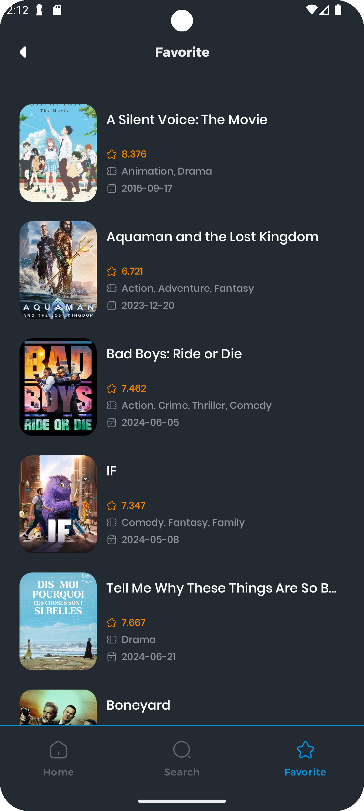
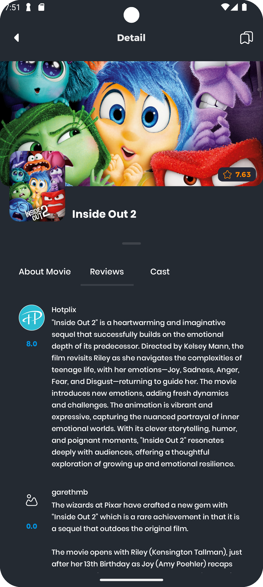
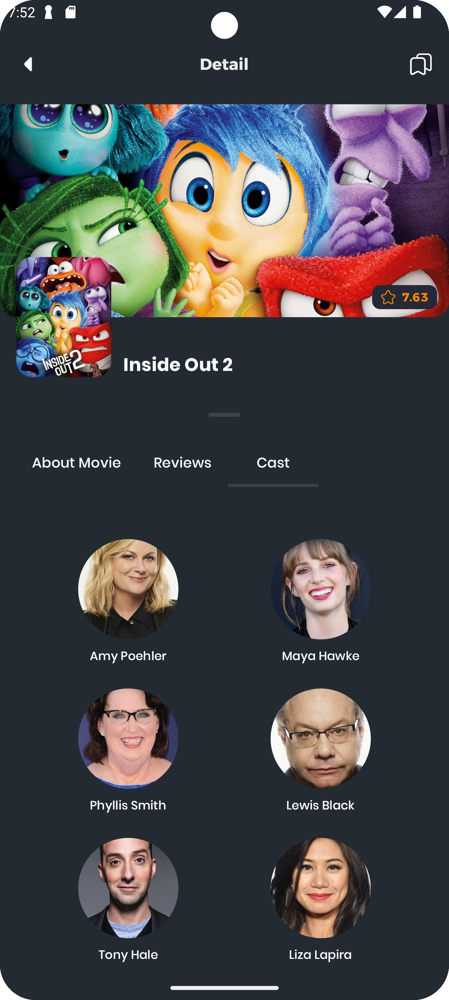

# Movie App

This is a simple movie app that allows users to search for movies, view details about them, and favorited them. The app uses the [TMDB API](https://developer.themoviedb.org/) to fetch movie data.

## Features
1. **Home page: Display a list of movies (now playing, popular, top rated, upcoming)**

2. **Search page: Search for movies**

|        **Search Page (with Results)**         |              **Search Page (No Results)**               |
|:-----------------------------------------:|:---------------------------------------------------:|
|  |  |

3. **Favorite page: Display a list of favorited movies**

4. **Movie detail page: Display details about a movie**

|                **Detail Page**                |              **Detail Page (Reviews)**               |               **Detail Page (Casts)**               |
|:-----------------------------------------:|:------------------------------------------------:|:-----------------------------------------------:|
|  |  |  |

## Support
**1. Jetpack Compose**

**2. Dynamic Feature**

**3. Paging 3**

**4. Clean Architecture**

## Credits
Made by Alvaro Austin